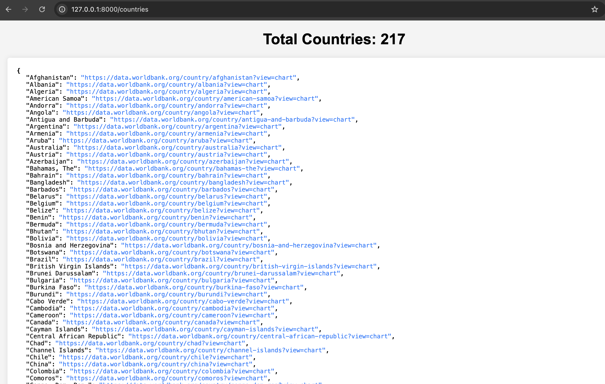
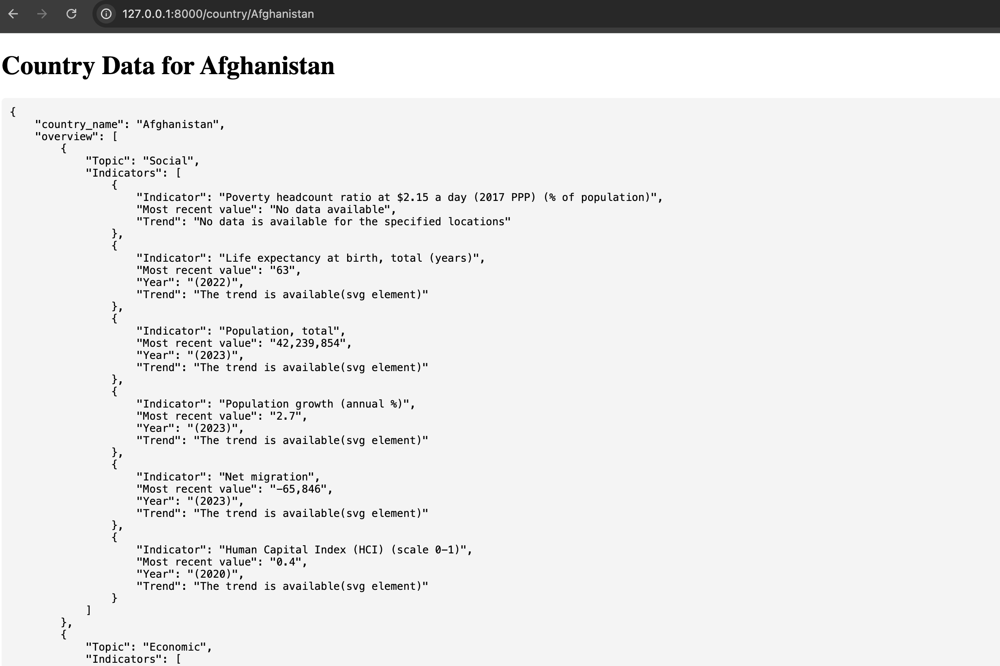

Here is the updated `README.md` based on your requirements:

---

# World Bank Country Data Scraper and API

This repository provides a FastAPI-based web scraper that extracts data from the World Bank website for each country and returns it in JSON or HTML format. It extracts data from three sections: "Overview", "By Theme", and "By SDG Goal" for each country.

## Requirements

Ensure the following are installed:

- **Python 3.10+**

### Preinstalled Requirements:

Install the required Python packages individually:

- FastAPI:
  ```bash
  pip install fastapi
  ```
- Uvicorn (to run the FastAPI server):
  ```bash
  pip install uvicorn
  ```
- Requests:
  ```bash
  pip install requests
  ```
- BeautifulSoup (for web scraping):
  ```bash
  pip install beautifulsoup4
  ```
- Selenium (for handling dynamic content):
  ```bash
  pip install selenium
  ```
- WebDriver Manager (for managing browser drivers for Selenium):
  ```bash
  pip install webdriver-manager
  ```

Ensure you have **ChromeDriver** or your preferred Selenium WebDriver installed.

## How it Works

### Files Overview

1. **world_bank_country_scraper.py**: 
   - **Function**: `scrape_countries(url="https://data.worldbank.org/country")`: Scrapes the country names and their respective URLs from the World Bank website.
   - **Sample output**:
     ```json
     {
       "Afghanistan": "https://data.worldbank.org/country/afghanistan",
       "Albania": "https://data.worldbank.org/country/albania"
     }
     ```

2. **country_data_extractor.py**:
   - **Function**: `scrape_all_panels_selenium(country_url)`: Extracts the HTML content from the "Overview", "By Theme", and "By SDG Goal" sections of the provided country's page.
   - **Returns**: A dictionary containing HTML content of the sections.
     

3. **country_data_transformer.py**:
   - **Functions**:
     - `parse_overview_data(overview_html)`: Parses the overview section HTML and returns relevant country data.
     - `parse_theme_data(theme_html)`: Parses the "By Theme" section HTML and returns relevant indicators and trends.
     - `parse_sdg_data(sdg_html)`: Parses the "By SDG Goal" section HTML and returns relevant goals and indicators.
   - **Each of these functions returns structured JSON data**.

4. **main.py**:
   - This is the entry point of the FastAPI application.
   - **Endpoints**:
     - `/`: Base endpoint, displays a message.
     - `/countries`: Returns the list of countries and their links in an HTML format.
     - `/country/{country_name}`: Returns JSON or HTML data for the specific country, including its "Overview", "By Theme", and "By SDG Goal" data.

### Sample API Requests

1. **Get All Countries**:
   ```
   GET /countries
   ```
   Response:
   

2. **Get Data for a Specific Country**:
   ```
   GET /country/afghanistan
   ```
   Response:
   
   

### Example FastAPI Server Execution

To start the FastAPI server, run the following command:
```bash
uvicorn main:app --reload
```

Navigate to `http://127.0.0.1:8000` in your browser. You can also explore the API documentation at `http://127.0.0.1:8000/docs`.

---
